# 📋 Evidências de testes

Este documento reúne as evidências de funcionamento da aplicação, cobrindo frontend, backend e banco de dados.

 

## 🎨 Frontend

### Formulário vazio

Tela inicial com todos os campos disponíveis para preenchimento.

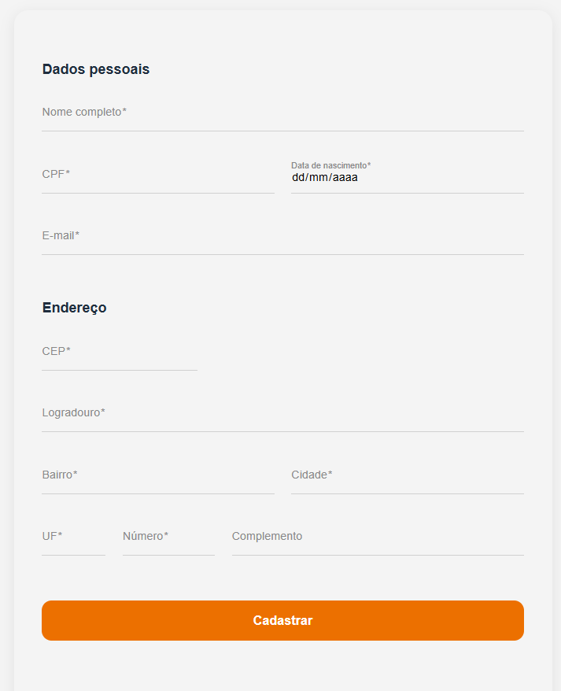

 

### Validação de campos obrigatórios

Ao tentar submeter o formulário sem preencher nenhum campo, todas as mensagens de erro são exibidas.

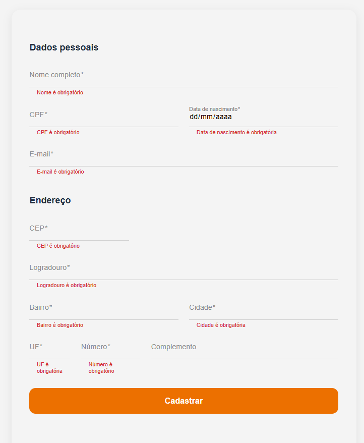

 

### Validação de campos inválidos + preenchimento automático de endereço via CEP

Campos com valores inválidos exibem mensagens específicas por campo. Ao informar um CEP válido, o endereço é preenchido automaticamente via ViaCEP.

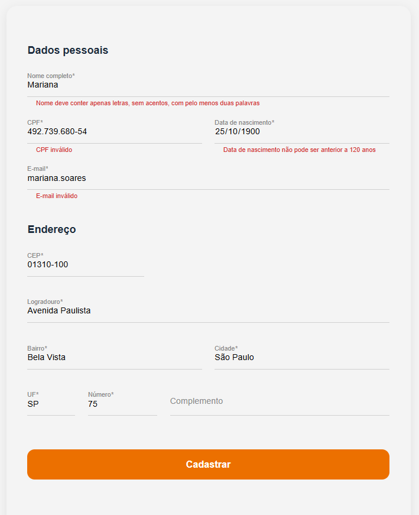

 

### Formulário preenchido corretamente

Formulário com todos os dados válidos antes de submeter.

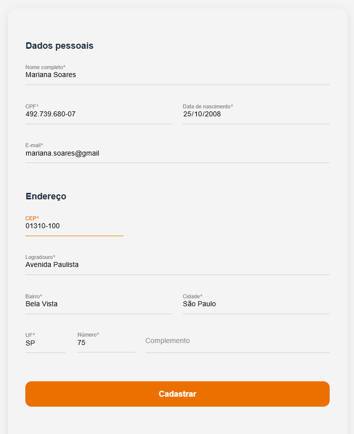

 

### Cadastro realizado com sucesso

Após o cadastro, o sistema exibe os dados cadastrados e o login gerado automaticamente.

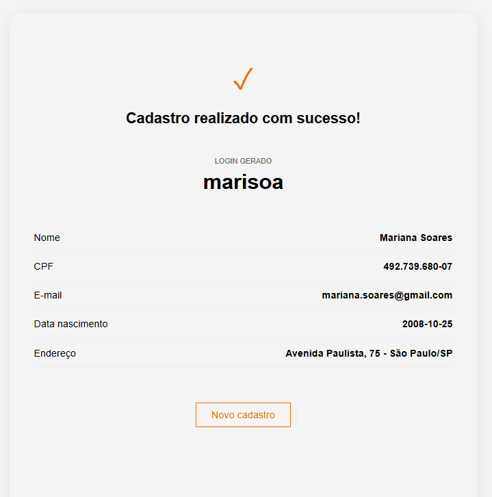

 

## ⚙️ Backend (Swagger UI)

### Campos vazios: 400 Bad Request

Chamada direta à API com campos vazios retorna `400` com mensagens específicas por campo.

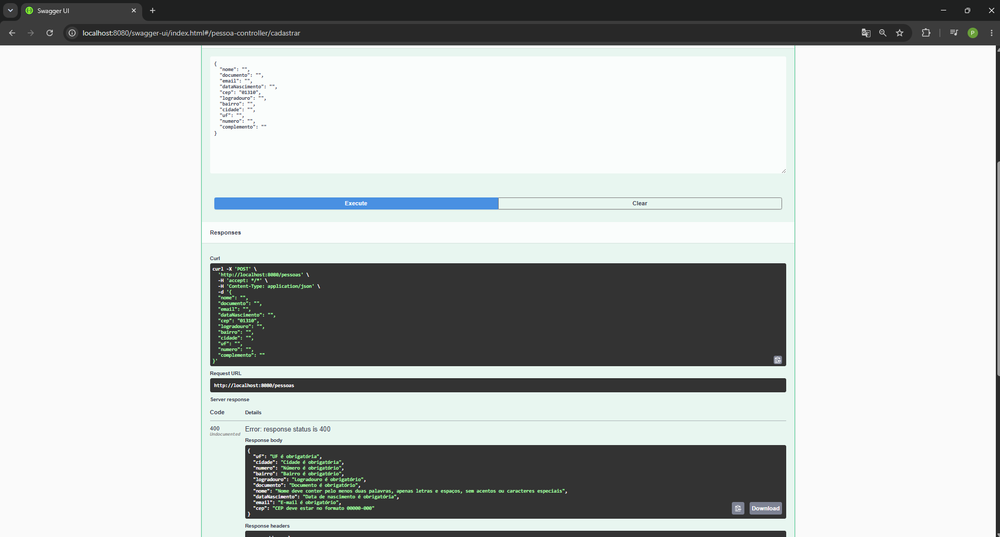

 

### CPF duplicado: 422 Unprocessable Entity

Tentativa de cadastro com CPF já existente retorna `422` com a mensagem `"CPF já cadastrado"`.

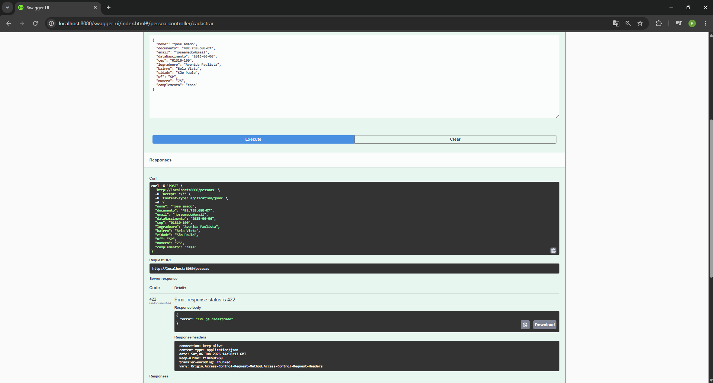

 

### E-mail duplicado: 422 Unprocessable Entity

Tentativa de cadastro com e-mail já existente retorna `422` com a mensagem `"E-mail já cadastrado"`.

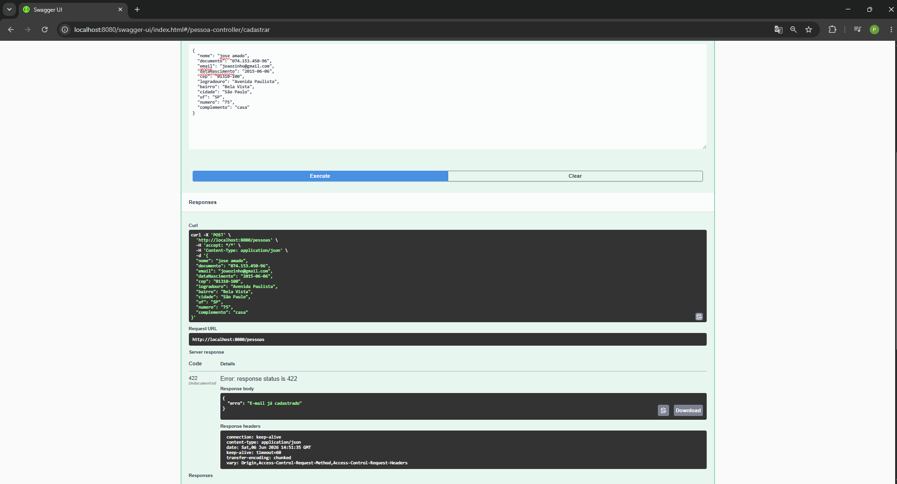

 

### CEP não encontrado: 422 Unprocessable Entity

CEP inválido ou inexistente retorna `422` com a mensagem `"CEP não encontrado"`.

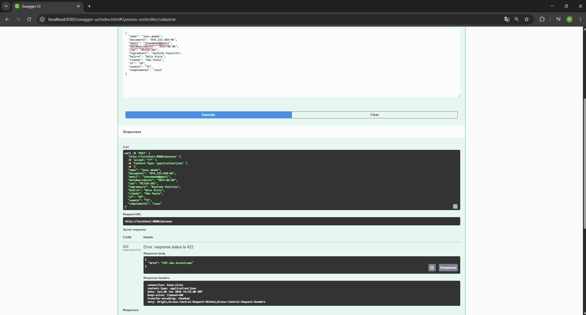

 

### Cadastro com sucesso: 201 Created

Cadastro válido retorna `201` com todos os dados persistidos e o login gerado.

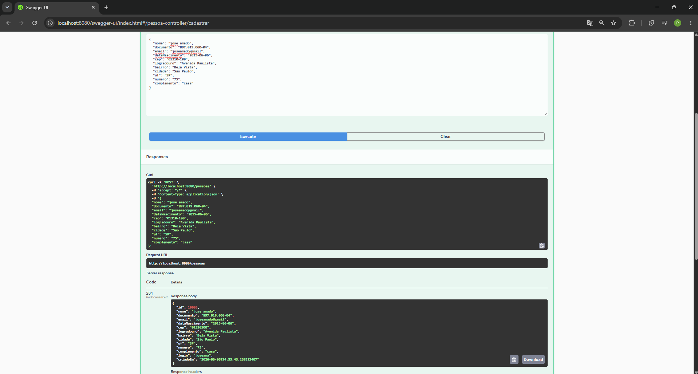

 

## 🧪 Testes unitários

### Backend: 14 testes passando

Execução do `./mvnw test` com `Tests run: 14, Failures: 0, Errors: 0, Skipped: 0` e `BUILD SUCCESS`.

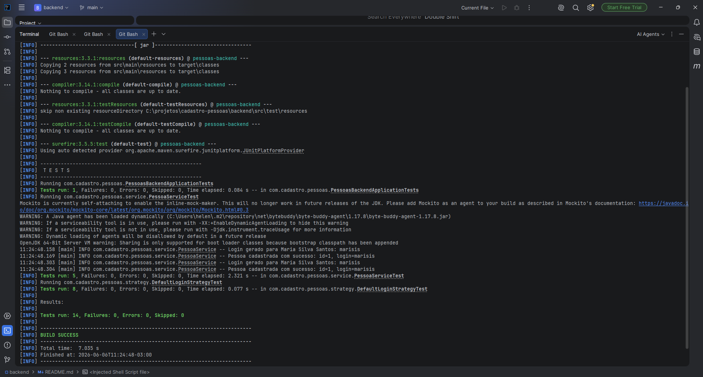

 

## 🗄️ Banco de dados

### Registros persistidos no SQL Server

25 registros no banco: 20 do seed (dados legados) + 5 cadastrados pelo frontend.

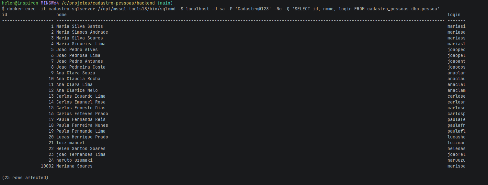