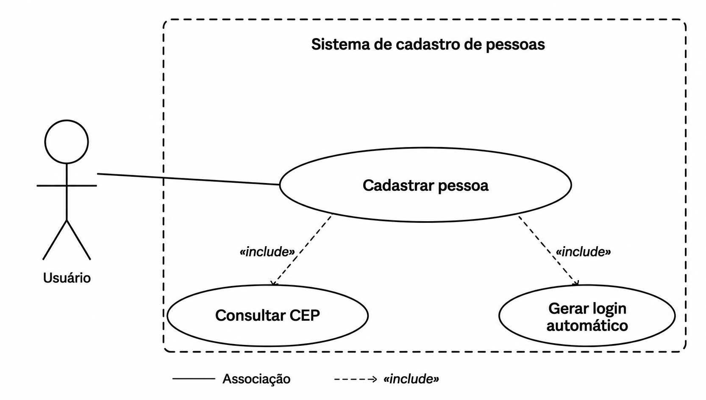
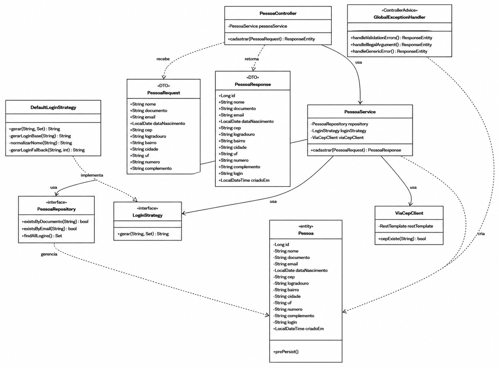
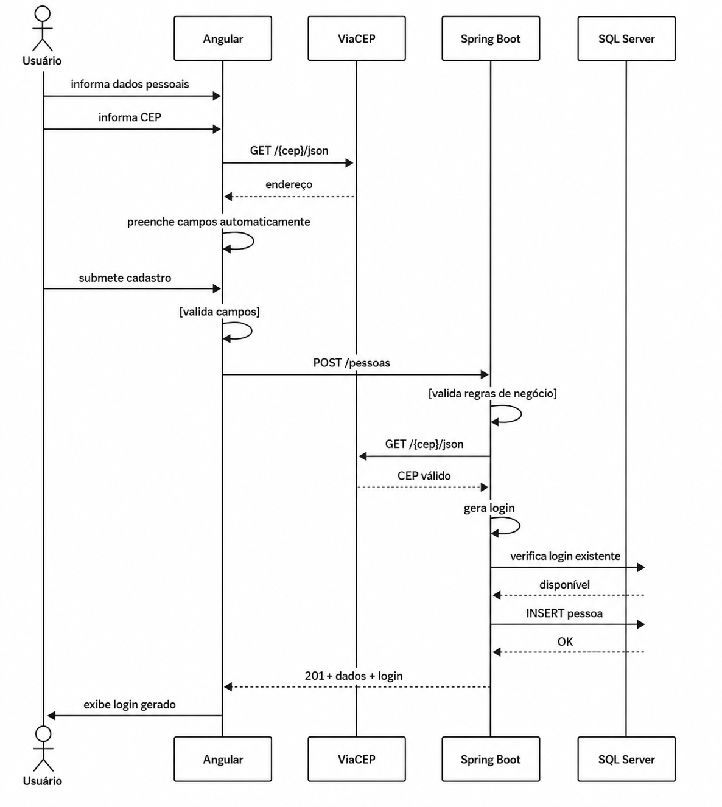

# 🏦 cadastro-pessoas-backend

Este projeto é um case técnico que consiste em desenvolver uma aplicação full stack de cadastro de pessoas com geração automática de login

API REST para cadastro de pessoas com geração automática de login, desenvolvida com Java 21 e Spring Boot 3

> 🎨 Frontend: [cadastro-pessoas-frontend](https://github.com/helen-silv4/cadastro-pessoas-frontend)

<br>


## 🚀 Stack

| Camada | Tecnologia |
|--------|-----------|
| Linguagem | Java 21 |
| Framework | Spring Boot 3.5 |
| Banco de dados | SQL Server 2022 |
| Migrations | Flyway |
| Documentação | SpringDoc OpenAPI (Swagger UI) |
| Testes | JUnit 5 + Mockito |
| Containerização | Docker + Docker Compose |
| CI/CD | GitHub Actions |

<br>

## 📋 Pré-requisitos

- Docker e Docker Compose
- Java 21 (para execução local)
- Maven (para execução local)

<br>

## ▶️ Como executar

### 🐳 Com Docker (recomendado)

```bash
git clone https://github.com/helen-silv4/cadastro-pessoas-backend.git
cd cadastro-pessoas-backend
docker compose up --build
```

| Serviço    | URL                                         |
|------------|---------------------------------------------|
| 🌐 Frontend   | http://localhost:4200                       |
| ⚙️ API        | http://localhost:8080                       |
| 📖 Swagger UI | http://localhost:8080/swagger-ui/index.html |

### 💻 Sem Docker (local)

Suba o banco de dados via Docker:

```bash
docker compose up db db-init
```

Execute o backend:

```bash
./mvnw spring-boot:run
```

<br>

> **Nota sobre o Docker:** Este foi meu primeiro contato com Docker na prática. A containerização do ambiente foi um desafio significativo, especialmente com o SQL Server, que exigiu bastante pesquisa e tentativas até funcionar corretamente. Apesar das dificuldades, consegui subir todo o ambiente (banco, backend e frontend) com um único comando: `docker compose up --build` 🙂

## 🔐 Algoritmo de geração de login

O login é gerado automaticamente a partir do nome da pessoa, respeitando as seguintes regras:

- ✅ Exatamente **7 caracteres**
- ✅ Apenas **letras minúsculas** (a–z)
- ✅ Sem espaços ou números
- ✅ **Único** no sistema

### 🧩 Design Pattern: Strategy

A geração é implementada via interface `LoginStrategy` e sua implementação `DefaultLoginStrategy`, seguindo o padrão **Strategy** para facilitar extensão futura sem modificar o código existente.

```
LoginStrategy (interface)
    └── DefaultLoginStrategy (implementação principal)
```

### 📐 Regra principal

**3 ou mais partes no nome:**
```
4 letras do primeiro + 2 letras do segundo + 1 letra do terceiro
```

**2 partes no nome:**
```
4 letras do primeiro + 3 letras do segundo
```

### 💡 Exemplos

| Nome                  | Login gerado |
|-----------------------|:------------:|
| Maria Silva Santos    | `marisis`    |
| Joao Pedro Alves      | `joaoped`    |
| Ana Clara Souza       | `anaclar`    |
| Carlos Eduardo Lima   | `carlose`    |
| Lucas Henrique Prado  | `lucashe`    |

### 🔄 Estratégia de fallback (unicidade)

Se o login base já existir no sistema, o algoritmo avança **letra por letra** no nome normalizado (sem espaços) até encontrar uma combinação de 7 letras ainda não cadastrada.

**Exemplo:** Para `Maria Silva Santos`, o login base é `marisis`. Se já existir:
- Tentativa 1: `arisisl`
- Tentativa 2: `risisla`
- Tentativa 3: `isislas`
- ... e assim por diante até encontrar um login único.

<br>

## 🗂️ Estrutura do projeto

```
src/main/java/com/cadastro/pessoas/
├── client/
│   └── ViaCepClient.java              # consulta CEP na API ViaCEP
├── config/
│   └── AppConfig.java                 # CORS, redirect e RestTemplate
├── controller/
│   └── PessoaController.java          # endpoint POST /pessoas
├── dto/
│   ├── PessoaRequest.java             # entrada da API
│   └── PessoaResponse.java            # saída da API
├── entity/
│   └── Pessoa.java                    # entidade JPA
├── exception/
│   └── GlobalExceptionHandler.java    # tratamento centralizado de erros
├── repository/
│   └── PessoaRepository.java          # acesso ao banco
├── service/
│   └── PessoaService.java             # regras de negócio
├── strategy/
│   ├── LoginStrategy.java             # interface Strategy
│   └── DefaultLoginStrategy.java      # implementação principal
└── validation/
    ├── CpfValido.java                 # anotação customizada
    ├── CpfValidator.java              # validador de CPF
    ├── DataNascimentoValida.java      # anotação customizada
    ├── DataNascimentoValidator.java   # validador de data
    ├── NomeValido.java                # anotação customizada
    └── NomeValidator.java             # validador de nome
```

<br>

## 🗄️ Banco de dados

O banco utilizado é o **SQL Server 2022**, gerenciado via Docker. As migrations são controladas pelo **Flyway**, aplicadas automaticamente na inicialização do backend.

### 📦 Migrations (Flyway)

O sistema já nasce com 20 registros pré-existentes, provenientes de um sistema legado. Por isso as migrations foram divididas em três etapas: criação do banco, criação da tabela e seed dos dados históricos.


| Versão | Arquivo                         | Descrição                       |
|--------|---------------------------------|---------------------------------|
| V0     | `V0__criar_banco.sql`           | Cria o banco `cadastro_pessoas` |
| V2     | `V2__seed_dados_iniciais.sql`   | Cria a tabela `pessoa`          |
| V3     | `V3__seed_pessoas.sql`          | Insere os 20 registros legados  |

<br>

## 🧪 Testes

```bash
./mvnw test
```

### Casos cobertos

**DefaultLoginStrategyTest**
- ✅ Geração de login com 3 nomes
- ✅ Geração de login com 2 nomes
- ✅ Login com exatamente 7 caracteres
- ✅ Login apenas com letras minúsculas
- ✅ Login alternativo quando base já existe
- ✅ Unicidade com múltiplos conflitos
- ✅ Login sem espaços
- ✅ Login sem números

**PessoaServiceTest**
- ✅ Cadastro com sucesso
- ✅ CPF já cadastrado
- ✅ E-mail já cadastrado
- ✅ CEP não encontrado
- ✅ Login único quando base já existe

<br>

## 📡 Observabilidade

| Operação                  | Nível   |
|---------------------------|---------|
| Recebimento de requisição | `INFO`  |
| Login gerado              | `INFO`  |
| Pessoa cadastrada         | `INFO`  |
| CEP não encontrado        | `WARN`  |
| Erro ao consultar ViaCEP  | `ERROR` |
| Erro de validação         | `WARN`  |
| Erro de negócio           | `WARN`  |
| Erro inesperado           | `ERROR` |


<br>

## ✅ Requisitos funcionais

| ID   | Requisito                            | Resumo                                                                                              |
|------|--------------------------------------|-----------------------------------------------------------------------------------------------------|
| RF01 | Cadastro de pessoa                   | Campos: nome, CPF, e-mail, nascimento, CEP, endereço, número (obrigatório) e complemento (opcional) |
| RF02 | Validação do nome                    | Obrigatório, apenas letras e espaços, sem acentos/cedilha/til, sem espaços excedentes               |
| RF03 | Validação do CPF                     | Obrigatório, formato `xxx.xxx.xxx-xx`, dígitos verificadores válidos, único no sistema              |
| RF04 | Validação do e-mail                  | Obrigatório, formato `nome@dominio.com`, único no sistema                                           |
| RF05 | Validação da data de nascimento      | Obrigatória, data real, não futura, não anterior a 120 anos                                         |
| RF06 | Validação do CEP                     | Obrigatório, 8 dígitos numéricos, erro claro se não encontrado no ViaCEP                            |
| RF07 | Preenchimento automático do endereço | Auto-preenche logradouro, bairro, cidade e UF via ViaCEP; número obrigatório; complemento opcional  |
| RF08 | Geração automática de login          | 7 chars, só letras minúsculas (a–z), sem espaços ou números, construído a partir do nome, único     |
| RF09 | Unicidade do login                   | Verifica existência antes de persistir; estratégia alternativa determinística e documentada         |
| RF10 | Persistência dos dados               | Todos os dados e o login gerado armazenados no SQL Server                                           |
| RF11 | Dados pré-existentes                 | 20 registros do `massa_dados.txt` carregados na inicialização; campos de endereço nulos (legado)    |
| RF12 | Retorno do cadastro                  | Exibe ao usuário todos os dados cadastrados e o login gerado                                        |
| RF13 | Feedback de erros                    | Mensagens claras e específicas por campo, no frontend e na API                                      |

<br>

## ⚙️ Requisitos não funcionais

| ID    | Requisito                 | Resumo                                                                  |
|-------|---------------------------|-------------------------------------------------------------------------|
| RNF01 | Backend                   | Java 21 + Spring Boot 3 (Web, JPA, Validation, JDBC SQL Server, Lombok) |
| RNF02 | Frontend                  | Angular 17+, Reactive Forms, Angular Material, HttpClient               |
| RNF03 | Banco de dados            | SQL Server via Docker (`mssql/server:2022-latest`)                      |
| RNF04 | Containerização           | Docker + Docker Compose, `docker compose up` sobe tudo                  |
| RNF05 | Migrations                | Flyway com aplicação automática na inicialização, incluindo seed        |
| RNF06 | Documentação da API       | SpringDoc OpenAPI — Swagger UI em `/swagger-ui/index.html`              |
| RNF07 | Validação em duas camadas | Validações no frontend e no backend de forma independente               |
| RNF08 | Testes automatizados      | JUnit 5 + Mockito, foco no algoritmo de geração de login                |
| RNF09 | Versionamento             | GitHub com commits organizados e descritivos                            |
| RNF10 | Identidade visual         | Laranja `#EC7000`, grafite `#1F2D3D`, tom institucional Itaú            |
| RNF11 | Responsividade            | Funciona em desktop, tablet e mobile                                    |
| RNF12 | Separação                 | Frontend e backend separados, comunicação exclusiva via REST            |
| RNF13 | Organização do código     | Camadas, DTOs, nomeação clara, sem código morto                         |
| RNF14 | Documentação              | README com execução, algoritmo de login explicado e prints de testes    |
| RNF15 | Design Pattern            | Strategy para geração de login                                          |
| RNF16 | Observabilidade           | Logs nas operações críticas: cadastro, login, conflitos, ViaCEP         |
| RNF17 | Orientação a Objetos      | Encapsulamento, abstração e polimorfismo aplicados                      |
| RNF18 | Publicação                | Diferencial opcional via Railway ou Render                              |

## 📊 Diagramas

### Diagrama de Caso de Uso



### Diagrama de Classe


### Diagrama de Sequência

